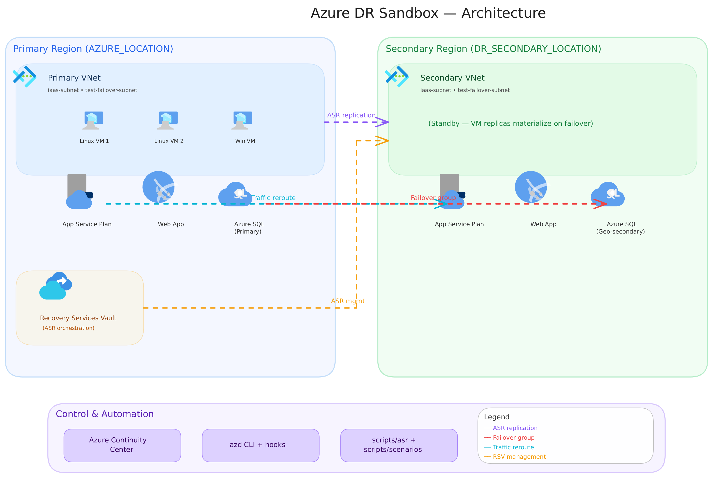
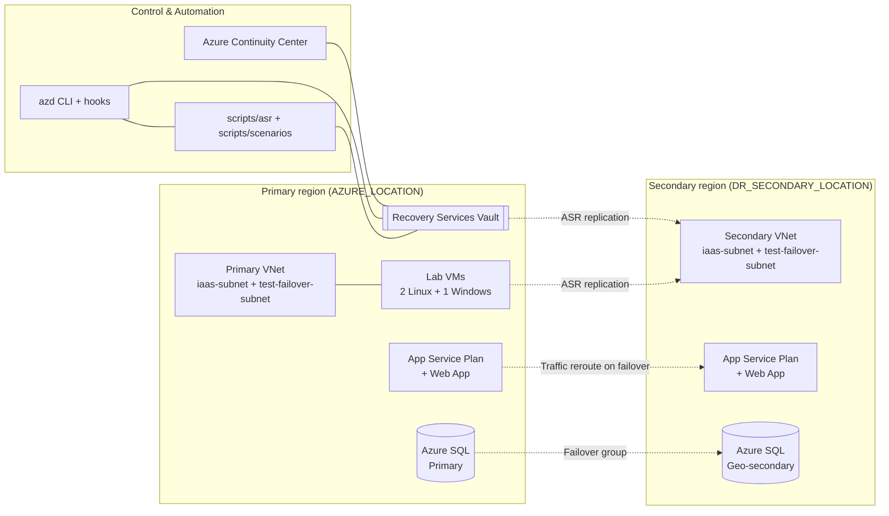

# Azure DR Sandbox

> End-to-end Azure disaster recovery lab — Azure Site Recovery for IaaS, App Service + Azure SQL geo-replication for PaaS, driven by Bicep and the Azure Developer CLI (azd). Portal-first exercises in Azure Continuity Center and Recovery Services Vault.

---

## Architecture Overview



> Open [docs/architecture.excalidraw](docs/architecture.excalidraw) in the Excalidraw editor (included in the dev container) for the interactive version with native Azure icons.

<details>
<summary>Mermaid fallback (click to expand)</summary>



</details>

See [docs/architecture.md](docs/architecture.md) for component details, mode behavior, and automation flow.

---

## Deployment Modes

| Mode   | What it deploys                                                     | DR strategy                           |
|--------|---------------------------------------------------------------------|---------------------------------------|
| `iaas` | VNets, Recovery Services Vault, lab VMs (2 Linux + 1 Windows)       | Azure Site Recovery replication       |
| `paas` | App Service plan + web app in 2 regions, Azure SQL + failover group | Geo-replication + manual failover     |
| `all`  | Everything above                                                    | Combined (default)                    |

---

## Prerequisites

Open this repo in the provided **Dev Container** — all required tooling (Azure CLI, `azd`, Bicep, PowerShell 7, `site-recovery` extension, ShellCheck, jq) is pre-installed.

If not using the dev container, install manually:

- Azure CLI
- Azure Developer CLI (`azd`)
- Bicep
- PowerShell 7+
- `az extension add --name site-recovery`

You also need Contributor rights on the target subscription.

---

## Quickstart

### 1. Login

```bash
azd auth login --use-device-code
az login --use-device-code
```

### 2. Configure (optional)

Defaults are set in [.devcontainer/devcontainer.json](.devcontainer/devcontainer.json) `remoteEnv`. Override only what you need:

```bash
# Mode: iaas | paas | all (default: all)
azd env set DR_DEPLOYMENT_MODE all

# Regions (must differ)
azd env set AZURE_LOCATION eastus2
azd env set DR_SECONDARY_LOCATION westus2

# Naming + topology
azd env set DR_PREFIX drsandbox
azd env set DR_LINUX_VM_COUNT 2
azd env set DR_DEPLOY_WINDOWS_VM true
azd env set DR_VM_ADMIN_USERNAME azureuser

# Required secrets (prompted on first azd up if not set)
azd env set DR_VM_ADMIN_PASSWORD '<secure-password>'

# Optional: override App Service SKU (default P0v3)
# azd env set DR_APP_SERVICE_SKU S1
```

| Variable                  | Default       | Notes                                      |
|---------------------------|---------------|--------------------------------------------|
| `DR_DEPLOYMENT_MODE`      | `all`         | `iaas`, `paas`, or `all`                   |
| `DR_PREFIX`               | `drsandbox`   | Resource naming prefix                     |
| `AZURE_LOCATION`          | `eastus2`     | Primary region                             |
| `DR_SECONDARY_LOCATION`   | `westus2`     | Secondary region (must differ from primary)|
| `DR_LINUX_VM_COUNT`       | `2`           | 1–5                                        |
| `DR_DEPLOY_WINDOWS_VM`    | `true`        | Include 1 Windows Server VM                |
| `DR_VM_ADMIN_USERNAME`    | `azureuser`   | VM admin username                          |
| `DR_VM_ADMIN_PASSWORD`    | _(unset)_     | Required for VM deployment                 |
| `DR_APP_SERVICE_SKU`      | `P0v3`        | App Service Plan SKU for PaaS lab          |
| `DR_ASR_AUTO_ENABLE`      | `false`       | Auto-enable ASR replication on deploy      |

### 3. Deploy

```bash
azd init       # First run only: pick an environment name
azd up         # Provisions infrastructure; ASR onboarding is manual by default
```

### 4. Run the labs

Start with [docs/labs/README.md](docs/labs/README.md) and work through the numbered exercises in Azure Continuity Center and Recovery Services Vault.

Helper scripts:

```bash
pwsh ./scripts/scenarios/replication-group-procedure.ps1
pwsh ./scripts/scenarios/restore-procedure.ps1
pwsh ./scripts/asr/cleanup-asr.ps1
```

### 5. Destroy

```bash
azd down --force --purge
```

Teardown runs `scripts/asr/cleanup-asr.ps1` via pre-down and post-down hooks so ASR artifacts are removed without generating a one-off cleanup script.

---

## Documentation Index

| Document                                     | Description                              |
|----------------------------------------------|------------------------------------------|
| [docs/architecture.md](docs/architecture.md) | Mode behavior, topology, automation flow |
| [docs/labs/README.md](docs/labs/README.md)   | Lab index and recommended order          |

---

## Design Principles

- **Portal-first labs** — Continuity Center and Recovery Services Vault lead; scripts are helpers.
- **Mode-gated infrastructure** — one `DR_DEPLOYMENT_MODE` flag controls the whole stack.
- **Automated ASR teardown** — no manually generated cleanup script is required.
- **Idempotent** — re-run `azd up` / `azd down` safely.
- **Self-contained** — every prereq is in the dev container.

---

## Notes

- ASR operations are asynchronous and can take 10–30 minutes to reflect in the portal.
- If `azd down` leaves resources in a deleting state, rerun `pwsh ./scripts/asr/cleanup-asr.ps1` once Azure finishes async work.
- Keep lab defaults small for cost control; scale `DR_LINUX_VM_COUNT` only when needed.
